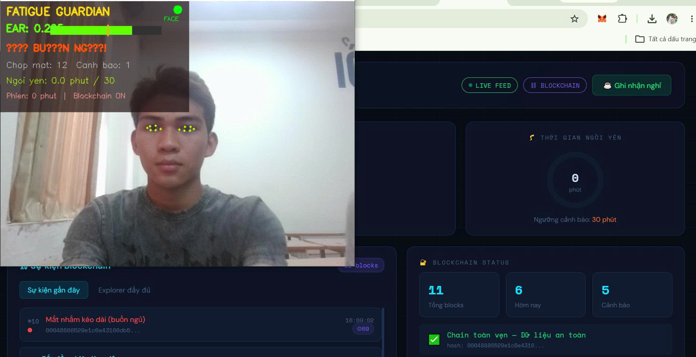
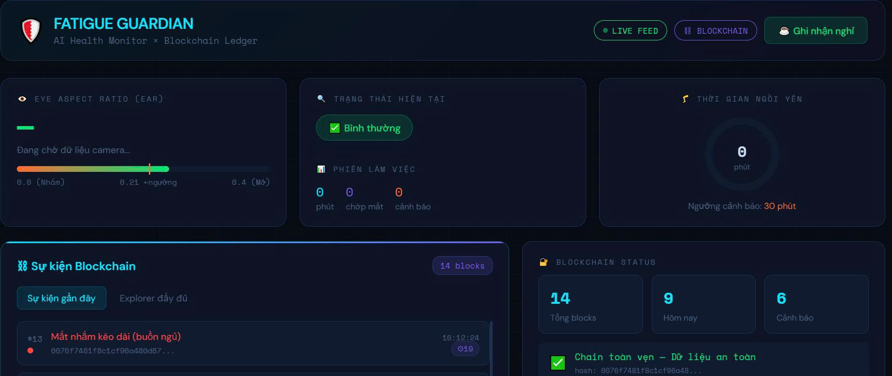
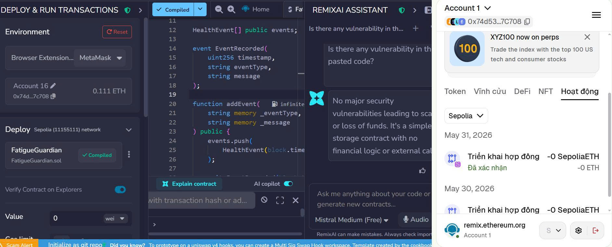

<div align="center">

# 🎓 Faculty of Information Technology (DaiNam University)

---

# FATIGUEGUARDIAN – HỆ THỐNG THIẾT BỊ NHẮC NHỞ NGỒI LÂU CHỐNG MỎI VÀ MỆT MỎI THỊ GIÁC

---

<table>
<tr>

<td align="center">
<br><br>
<b>DaiNam University</b>
</td>

<td align="center">
<br><br>
<b>AIoT Lab</b>
</td>

<td align="center">
<br><br>
<b>Faculty of Information Technology</b>
</td>

</tr>
</table>

<br>


</div>

---

# 📖 1. GIỚI THIỆU ỨNG DỤNG

FatigueGuardian là hệ thống giám sát sức khỏe người dùng theo thời gian thực thông qua camera máy tính, hỗ trợ phát hiện các dấu hiệu mệt mỏi, buồn ngủ và ngồi lâu liên tục trong quá trình học tập hoặc làm việc.

Hệ thống ứng dụng công nghệ Computer Vision và Trí tuệ nhân tạo để phân tích trạng thái khuôn mặt, theo dõi chuyển động và đánh giá mức độ tập trung của người dùng. Các sự kiện quan trọng được lưu trữ trong Blockchain nhằm đảm bảo tính minh bạch, toàn vẹn và không thể chỉnh sửa dữ liệu.

Dự án hướng tới việc xây dựng một giải pháp hỗ trợ chăm sóc sức khỏe số cho học sinh, sinh viên và nhân viên văn phòng.

## Chức năng chính

* Phát hiện trạng thái buồn ngủ bằng Eye Aspect Ratio (EAR)
* Phát hiện người dùng ngồi yên quá lâu
* Theo dõi khuôn mặt bằng MediaPipe Face Mesh
* Gửi cảnh báo thời gian thực
* Dashboard Web theo dõi dữ liệu trực tiếp
* Lưu lịch sử hoạt động bằng Blockchain cục bộ
* Kết nối Ethereum Sepolia Testnet
* Ký giao dịch bằng MetaMask
* Lưu TxHash trên Blockchain
* Thống kê dữ liệu sức khỏe theo thời gian thực
* Hỗ trợ xuất dữ liệu phục vụ phân tích

---

# 🛠️ 2. CÔNG NGHỆ SỬ DỤNG

| Thành phần           | Công nghệ              |
| -------------------- | ---------------------- |
| Computer Vision      | MediaPipe Face Mesh    |
| Eye Detection        | Eye Aspect Ratio (EAR) |
| Motion Detection     | OpenCV                 |
| Backend              | Flask                  |
| Dashboard            | HTML, CSS, JavaScript  |
| Database             | JSON Blockchain Ledger |
| Blockchain           | Ethereum Sepolia       |
| Wallet               | MetaMask               |
| Smart Contract       | Solidity               |
| Blockchain Library   | Web3.py                |
| Notification         | Plyer                  |
| Environment          | Python-dotenv          |
| Programming Language | Python 3.11            |

---

# ⚙️ 3. KIẾN TRÚC HỆ THỐNG

```text
Camera
   │
   ▼
MediaPipe Face Mesh
   │
   ▼
EAR + Motion Analysis
   │
   ▼
Fatigue Detection Engine
   │
   ├────────► Notification System
   │
   ├────────► Local Blockchain Ledger
   │
   ├────────► Flask Dashboard
   │
   └────────► Ethereum Sepolia
                     │
                     ▼
                 MetaMask
```

---

# 📊 4. QUY TRÌNH HOẠT ĐỘNG

1. Camera thu nhận hình ảnh thời gian thực.

2. MediaPipe Face Mesh xác định các điểm đặc trưng trên khuôn mặt.

3. Hệ thống tính toán chỉ số EAR để đánh giá trạng thái mắt.

4. OpenCV phân tích chuyển động để phát hiện ngồi lâu.

5. Khi phát hiện sự kiện bất thường:

   * EYES_CLOSED
   * DROWSY
   * SEDENTARY

   hệ thống sẽ:

   * Hiển thị cảnh báo
   * Ghi dữ liệu vào blockchain cục bộ
   * Gửi giao dịch lên Ethereum Sepolia

6. Dashboard cập nhật dữ liệu theo thời gian thực.

---

# 🔐 5. BLOCKCHAIN VÀ TÍNH TOÀN VẸN DỮ LIỆU

Mỗi sự kiện được lưu thành một Block chứa:

* Timestamp
* Event Type
* Event Details
* Previous Hash
* Current Hash
* Nonce
* Difficulty

Dữ liệu được bảo vệ bằng thuật toán SHA-256 kết hợp cơ chế Proof-of-Work nhằm đảm bảo:

* Không thể chỉnh sửa dữ liệu cũ
* Có thể xác thực lịch sử sự kiện
* Hỗ trợ kiểm tra tính toàn vẹn dữ liệu sức khỏe

Ngoài blockchain cục bộ, hệ thống còn hỗ trợ lưu TxHash lên Ethereum Sepolia Testnet nhằm tăng khả năng xác thực và minh bạch dữ liệu.

---

# 📈 6. KẾT QUẢ THỬ NGHIỆM

| Tiêu chí                        | Kết quả           |
| ------------------------------- | ----------------- |
| Độ chính xác phát hiện mắt nhắm | 91.9%             |
| Độ chính xác phát hiện ngồi yên | 94.2%             |
| FPS Desktop                     | 37.5 FPS          |
| FPS Laptop                      | 25.2 FPS          |
| Blockchain Integrity            | 100%              |
| Giao dịch Sepolia               | Thành công        |
| Dashboard Realtime              | Hoạt động ổn định |

---

# 📸 7. MỘT SỐ HÌNH ẢNH HỆ THỐNG

## Phát hiện khuôn mặt bằng MediaPipe

<p align="center">

</p>

## Dashboard thời gian thực

<p align="center">

</p>

## Kết nối Blockchain Ethereum Sepolia

<p align="center">

</p>

---

# 🚀 8. HƯỚNG DẪN CHẠY DỰ ÁN

## Clone Source

```bash
git clone https://github.com/your-repository/FatigueGuardian.git
cd FatigueGuardian
```

## Tạo môi trường ảo

```bash
python -m venv venv
```

## Kích hoạt

```bash
venv\Scripts\activate
```

## Cài thư viện

```bash
pip install -r requirements.txt
```

## Chạy chương trình

```bash
python main.py
```

---

# 👨‍💻 Tác giả

**Hoàng Anh Tú**

Khoa Công nghệ Thông tin

Trường Đại học Đại Nam

Năm thực hiện: 2026
